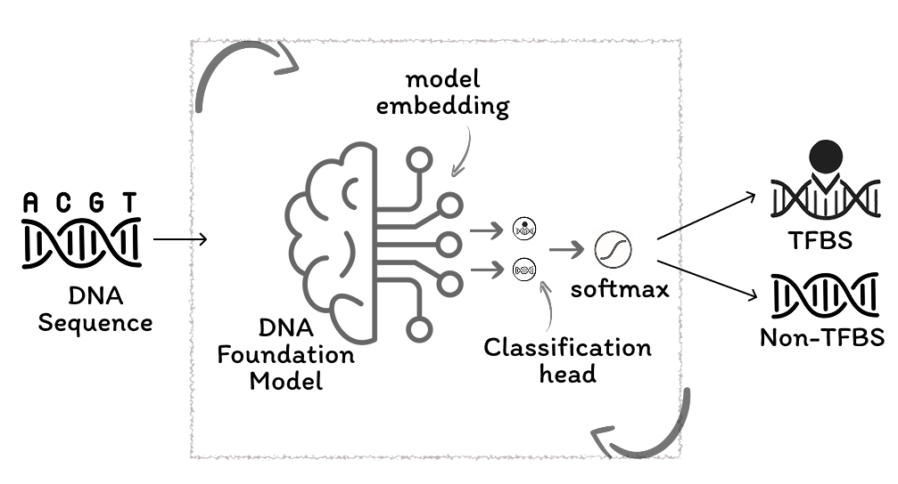

# Harnessing DNA Foundation Models for Cross-Species TFBS Prediction in Plants



## Overview

This project fine-tunes large pretrained DNA foundation models to predict transcription factor binding sites (TFBSs) in plant genomes.
We benchmark three foundation models:**DNABERT-2**, **AgroNT**, and **HyenaDNA**, against specialized methods like **DeepBind** and **BERT-TFBS** using DAP-seq data from *Arabidopsis thaliana* and *Sisymbrium irio*.

In addition, we include a motif-based approach employing MEME for motif discovery and FIMO for scanning potential TFBSs.

The project uses a unified pipeline, which covers three evaluation protocols:

1. **Cross-chromosome**: Leave-one-chromosome-out evaluation on *A. thaliana* (Sun2022). 
2. **Cross-dataset**: Train on Malley2016 AREB/ABF2 dataset, test on Sun2022 AREB/ABF2 dataset.
3. **Cross-species**: Train on one species, test on the other (Sun2022).

The **HyenaDNA** model achieves near state-of-the-art accuracy while training in minutes, demonstrating both predictive power and computational efficiency.

## Installation

To get started, follow these steps:

1. **Clone the repository**  
   ```bash
   git clone https://github.com/Maryam-Haghani/TFBS.git
   cd TFBS
   ```


2. **Create conda environment**

This project provides two Conda environment files:

- **Linux System :**  
  Use [`environment_linux.yml`](environment_Linux.yml)  
  ```bash
  conda env create -f environment_linux.yml
  conda activate tfbs
  ```

- **Cross-platform (works on Linux, macOS, Windows):**  
  Use [`environment_cross-platform.yml`](environment_cross-platform.yml)  
  ```bash
  conda env create -f environment_cross-platform.yml
  conda activate tfbs
  ```
> ⚠️ If you are not on Linux with an NVIDIA GPU, **do not use** the Linux environment file.
   
3. **Navigate to the code directory**:
   ```bash
   cd ./TFBS/code
   ```

---

## 1. Data Preparation
The DAP-seq peak used in this project come from [Ronan et al., 2016](https://pubmed.ncbi.nlm.nih.gov/27203113/) and [Sun et al., 2022](https://pubmed.ncbi.nlm.nih.gov/35501452/).  
Genome sequences and DAP-seq peak files are available on [Zenodo](https://zenodo.org/records/17229680) (DOI: 10.5281/zenodo.17229680).  

After downloading, place the files in the project directory as follows:  
- `./TFBS/data/fastas/` → genome FASTA files  
- `./TFBS/data/peak_files/` → DAP-seq peak files  

We used the `01-generate_samples.py` script to process raw data and generate positive and negative samples for transcription factor (TF) binding sites.
It takes as input a FASTA file of chromosome sequences for species genome and a CSV file containing peak regions.
Negative sample will be generated based on `neg_type` argument with default value of "dinuc_shuffle".

### Usage
To run the script, use the following command:

```bash
python 01-generate_samples.py --fasta_file path/to/your.fasta --peak_file path/to/peaks.csv --output_file path/to/output.csv --neg_type shuffle --species SI/ATA --dataset Malley2016/Sun2022
```

#### Arguments
- `--fasta_file`: Path to the genome FASTA file.
- `--peak_file`: Path to the CSV file containing peak data.
- `--species`: Species type (currently supporting *S. irio* and *A. thaliana*).
- `--dataset`: Origin of peak files.
- `--output_file`: Path to save the output CSV file to contain positive and negative samples.
- `--neg_type`: Method to generate negative samples (e.g., "dinuc_shuffle", "shuffle", "random").
- `--sliding_window`: Window around the peak region. Sample lengths vary based on the original peak length.
- `--fixed_length`:  If specified, generates samples of fixed length, ignoring the sliding window.

#### Example
##### For *A. thaliana* (ABF1-4) dataset:
```bash
python 01-generate_samples.py --fasta_file ../data/fastas/Arabidopsis_thaliana.TAIR10.dna_sm.toplevel.fa --peak_file ../data/peak_files/Sun2022-AtABFs_DAP-Seq_peaks.csv --species "At" --dataset Sun2022 --neg_type dinuc_shuffle --output_file ../data/samples/Sun2022-AtABFs_dinuc_shuffle_neg_stride_200.csv
```
To run this command, you should download the FASTA file for the *A. thaliana* genome and place it in the `./TFBS/data/fastas` directory.
##### For *S. irio* (ABF1-4) dataset:
```bash
python 01-generate_samples.py --fasta_file ../data/fastas/Si_sequence --peak_file ../data/peak_files/Sun2022-SiABFs_DAP-Seq_peaks.csv --species "Si" --dataset Sun2022 --neg_type dinuc_shuffle --output_file ../data/samples/Sun2022-SiABFs_dinuc_shuffle_neg_stride_200.csv  
```
To run this command, you should download the FASTA file for the *S. irio* genome and place it in the `./TFBS/data/fastas` directory.
### Output
This will generate positive and negative samples based on the given negative type generation, for the given species using the provided FASTA file and peak data, saving the results to `--output_file`.


## 2. Data Split
### Description

This script splits the data based on the provided configuration file.

### Usage
To run the script, use the following command:

```bash
python 02-split_data.py --config_file [config_path]
```

#### Arguments
- `--config_file`: Path to the configuration YAML file, which contains settings for the data split (file paths, random seed, etc.).

Data split configurations are located in the `/configs/data_split` directory.

#### Cross-configs
- `cross_chromosome_config.yml`: Use `test_id` values between **1** and **5**.
- `cross_species_config.yml`: Use `test_id` as either **At** or **Si**.
- `cross_dataset_config.yml`: Use provided dataset identifiers.

#### Example
If you have a configuration file located at `../configs/data_split/cross-species-config.yml`, run:

```bash
python 02-split_data.py --config_file ../configs/data_split/cross-species-config.yml
```

### Output
Data splits are stored in `<config.split_dir>/<config.name>`.

## 3. Training / Fine-tuning Models on a Split
### Description
A two‐stage pipeline that:
1. **Phase 1:** Trains model on each training fold, evaluates validation set over several training parameters (such as batch size, learning rate, and weight decay), and picks the parameters with the highest average F1.
2. **Phase 2:** Retrains the model on the full training set on the best hyperparameters for multiple random seeds, predicts for the held‑out test set, and logs key metrics (MCC, F1, accuracy, AUROC, AUPRC) for each seed.

It integrates with [Weights & Biases (wandb)](https://wandb.ai) for experiment tracking and visualization.
To enable logging, you should specify the `entity_name` and `token` values under the `wandb` parameter in the training configuration file.

```yaml
wandb:
  entity_name: "your_wandb_username_or_team"
  token: "your_wandb_api_token"
```

### Usage
To run the script, use the following command:

```bash
python 03-train.py --train_config_file [train_config_path] --split_config_file [data_config_path]
```

#### Arguments
- `--train_config_file`: Path to the training configuration YAML file.
- `--split_config_file`: Path to the data split configuration YAML file.

#### Example
```bash
python 03-train.py --train_config_file ../configs/train/HeynaDNA-config.yml --split_config_file ../configs/data_split/cross-species-config.yml
```

### Output
Trained models and logs are saved in `<config.output_dir>/<split_config.name>/`

`prediction_results.csv` will have prediction metrics for different seeds.

## 4. Prediction
### Description
This script generates predictions from saved pre-trained models for a dataframe or a genome sequence.

### Usage
To run the script, use the following command:

```bash
python 04-predict.py --config_file [config_path]
```

#### Arguments
- `--config_file`: The path to the configuration YAML file.

### Example
```bash
python 04-predict.py --config_file ../configs/predict/HeynaDNA-config.yml
```
#### Output
A directory named `<config.input_dir without extension>` will be created inside the `predictions` folder, located within the parent directory of the saved model directory (`config.saved_model_dir`).
Inside this directory, a CSV file containing predictions for each sequence will be saved, named after each model, corresponding to the models saved in the model directory.
Additionally, a `prediction_result.csv` file will be generated, summarizing performance metrics for all models.

## 5. Motif-Based Prediction (Traditional Approach)
This script generates predictions from traditional motif-based approach.

A two‐stage [MEME](https://meme-suite.org/meme/doc/meme.html) + [FIMO](https://meme-suite.org/meme/doc/fimo.html) pipeline that:
1. **Phase 1:** Runs MEME on each training fold, scans validation sequences with FIMO over several q‑value thresholds, and picks the threshold with the highest average F1.
2. **Phase 2:** Retrains MEME on the full training set for multiple random seeds, applies FIMO with the chosen q‑value to the held‑out test set, and logs key metrics (MCC, F1, accuracy, AUROC, AUPRC) for each seed.

### Usage
To run the script, use the following command:

```bash
python 05-predict_motif.py --split_config_file [split_config_path] --motif_config_file [motif_config_path]
```

#### Arguments
- `--split_config_file`: The path to the data split configuration YAML file.
- `--motif_config_file`: The path to the motif configuration YAML file.

#### Example
```bash
python 05-predict_motif.py --motif_config_file ../configs/motif-based.yml --split_config_file ../configs/data_split/cross-species-config.yml
```

### Output
`prediction_results.csv` will have prediction metrics for different seeds.

## Requirements

- Python 3.9+  
- PyTorch 1.12+  
- Transformers 4.20+  
- scikit-learn 1.0+  
- pandas, numpy, matplotlib  

See **requirements.txt** for exact versions.

---

## Citation

If you use this code or data, please cite:

> Haghani M., Dhulipalla K.V., Li S. “Harnessing DNA Foundation Models for Cross-Species Transcription Factor Binding Site Prediction in Plant Genomes.” *bioRxiv* (2025).  

```bibtex
@article{Haghani2025TFBS,
  title   = {Harnessing DNA Foundation Models for Cross-Species Transcription Factor Binding Site Prediction in Plant Genomes},
  author  = {Haghani, Maryam and Dhulipalla, Krishna Vamsi and Li, Song},
  journal = {Proceedings of the 20th Machine Learning in Computational Biology, PMLR},
  year    = {2025},
  url     = {https://proceedings.mlr.press/v311/haghani25a.html
}
}
```
---

## Contact

For questions or issues, please open an issue on GitHub or contact **haghani@vt.edu**.
